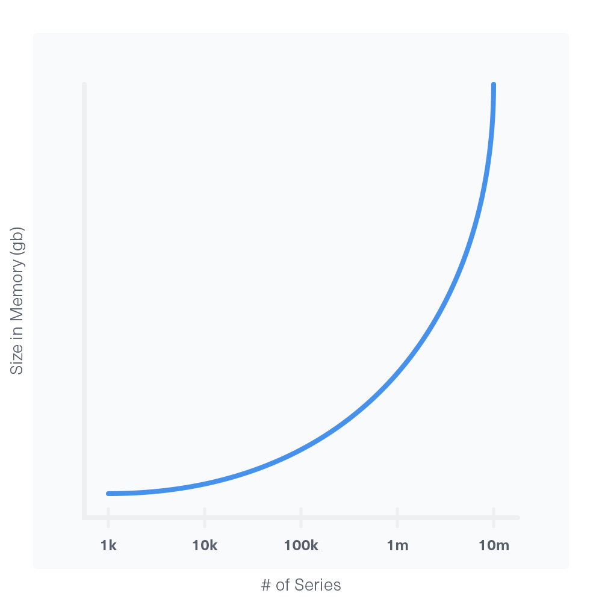

# 硬件指南

这一章会提供一些InfluxDB的硬件推荐，并会回答一些问的最多的关于硬件的问题。下面的推荐都是基于InfluxDB 1.2中的`TSM`存储引擎。

将要探讨的问题：

* 是用单节点还是集群？
* 对于单节点的一般硬件指南
* 对于集群的硬件指南
* 什么时候需要更多的内存？
* 需要那种类型的磁盘？
* 需要多大的存储空间？
* 该怎么配置硬件？

好现在我们来一一看看这些问题：

## 是用单节点还是集群？
InfluxDB的单节点是完全开源的，InfluxDB的集群版本是闭源的商业版。单节点的实例没有冗余，如果服务不可用，写入和读取数据都会马上失败。集群提供了高可用和冗余，多个数据副本分布在多台服务器上，任何一台服务器的丢失都不会对集群造成重大的影响。

如果您的性能要求仅仅是中等或低负载范围，那么使用单节点的InfluxDB实例就够了。如果你对性能要求相当高，那么你需要集群将负载分担到多台机器上。

## 对于单节点的一般硬件指南
我们这里定义的InfluxDB的负载是基于每秒的写入的数据量、每秒查询的次数以及唯一series的数目。基于你的负载，我们给出CPU、内存以及IOPS的推荐。

InfluxDB应该跑在SSD上，任何其他存储配置将具有较低的性能特征，并且在正常处理中可能甚至无法从小的中断中恢复。

负载|每秒写入的字段数|每秒中等查询数|series数量
---- | ---|---- | ---
低|< 5千|<5|<10万
中等|<25万|<25|<1百万
高|>25万|>25|>1百万
相当高|>75万|>100|>1千万

>说明：查询对于系统性能的影响很大  
>简单查询：  
>
* 几乎没有函数和正则表达式
* 时间限制在几分钟，或是几个小时，又或者到一天
* 通常在几毫秒到几十毫秒内执行  

>中等查询：
>
* 有多个函数或者一两个正则表达式
* 有复杂点的`GROUP BY`语句或是时间有几个星期的数据
* 通常在几百毫秒到几千毫秒内执行

>复杂查询：
>
* 有多个聚合函数、转换函数或者多个正则表达式
* 时间跨度很大有几个月或是几年
* 通常执行时间需要几秒

### 低负载推荐
* CPU：2~4核
* 内存：2~4GB
* IOPS：500

### 中等负载推荐
* CPU：4~6核
* 内存：8~32GB
* IOPS：500~1000

### 高负载推荐
* CPU：8+核
* 内存：32+GB
* IOPS：1000+

### 超高负载
要达到这个范围挑战很大，甚至可能不能完成；联系我们的`t sales@influxdb.com`寻求专业帮助吧。

## 对于集群的硬件指南
### 元节点
一个集群至少要有三个独立的元节点才能允许一个节点的丢失，如果要容忍`n`个节点的丢失则需要`2n+1`个元节点。集群的元节点的数目应该为奇数。不要是偶数元节点，因为这样在特定的配置下会导致故障。

元节点不需要多大的计算压力，忽略掉集群的负载，我们建议元节点的配置：

* CPU:1~2核
* 内存：512MB~1GB
* IOPS：50

### 数据节点
一个集群运行只有一个数据节点，但这样数据就没有冗余了。这里的冗余通过写数据的RP中的`副本个数`来设置。一个集群在丢失`n-1`个数据节点后仍然能返回完整的数据，其中`n`是副本个数。为了在集群内实现最佳数据分配，我们建议数据节点的个数为偶数。

对于集群的数据节点硬件的推荐和单节点的类似，数据节点应该至少有两个核的CPU，因为必须处理正常的读取和写入压力，以及集群内的数据的读写。由于集群通信开销，集群中的数据节点处理的吞吐量比同一硬件配置上的单实例的要少。

负载|每秒写入的字段数|每秒中等查询数|series数量
---- | ---|---- | ---
低|< 5千|<5|<10万
中等|<10万|<25|<1百万
高|>10万|>25|>1百万
相当高|>50万|>100|>1千万

>说明：查询对于系统性能的影响很大  
>简单查询：  
>
* 几乎没有函数和正则表达式
* 时间限制在几分钟，或是几个小时，又或者到一天
* 通常在几毫秒到几十毫秒内执行  

>中等查询：
>
* 有多个函数或者一两个正则表达式
* 有复杂点的`GROUP BY`语句或是时间有几个星期的数据
* 通常在几百毫秒到几千毫秒内执行

>复杂查询：
>
* 有多个聚合函数、转换函数或者多个正则表达式
* 时间跨度很大有几个月或是几年
* 通常执行时间需要几秒

### 低负载推荐
* CPU：2~4核
* 内存：2~4GB
* IOPS：1000

### 中等负载推荐
* CPU：4~6核
* 内存：8~32GB
* IOPS：1000+

### 高负载推荐
* CPU：8+核
* 内存：32+GB
* IOPS：1000+

### 企业Web节点
企业Web服务器主要充当具有类似负载要求的HTTP服务器。 对于大多数应用程序，它不需要性能很强。 一般集群将仅使用一个Web服务器，但是考虑到冗余，可以将多个Web服务器连接到单个后端Postgres数据库。

>注意：生产集群不应该使用SQLite数据库，因为它不被冗余的Web服务器允许，也不能像Postgres一样处理高负载。

推荐配置：

* CPU：1~4核
* 内存：1~2GB
* IOPS：50

## 什么时候需要更多的内存？
一般来讲，内存越多，查询的速度越快，增加更多的内存总没有坏处。

影响内存的最主要的因素是series基数，series的基数大约或是超过千万时，就算有更多的内存也可能导致OOM，所以在设计数据的格式的时候需要考虑到这一点。

内存的增长和series的基数存在一个指数级的关系：

## 需要哪种类型的磁盘？
InfluxDB被设计运行在SSD上，InfluxData团队不会在HDD和网络存储上测试InfluxDB，所以不太建议在生产上这么去使用。在机械磁盘上性能会下降一个数量级甚至在中等负载下系统都可能死掉。为了最好的结果，InfluxDB至少需要磁盘提供1000 IOPS的性能。

注意集群的数据节点在做故障恢复的时候需要更高的IOPS，所以考虑到可能的数据恢复，我们建议磁盘至少有2000的IOPS，低于1000的IOPS，集群可能无法即时从短暂的中断中恢复。

## 需要多大的存储空间？
数据库的名字、measurement、tag keys、field keys和tag values只被存储一次且只能是字符串。只有field values和timestamp在每个数据点上都有存储。

非字符串类型的值大约需要3字节，字符串类型的值需要的空间由字符串的压缩来决定。

## 该怎么配置硬件？
当在生产上运行InfluxDB时，`wal`和`data`文件夹需要在存储设备上分开。当系统处于大量写入负载下时，此优化可显着减少磁盘争用。 如果写入负载高度变化，这是一个重要的考虑因素。 如果写入负载不超过15％，则可能不需要优化。